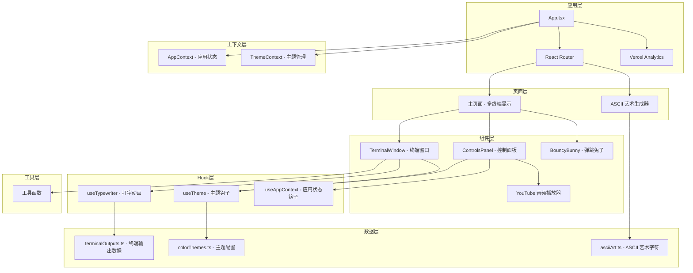
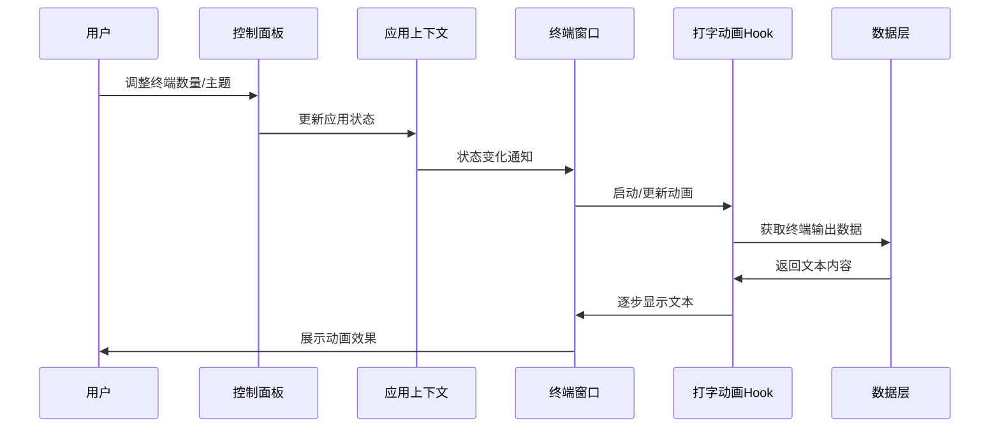
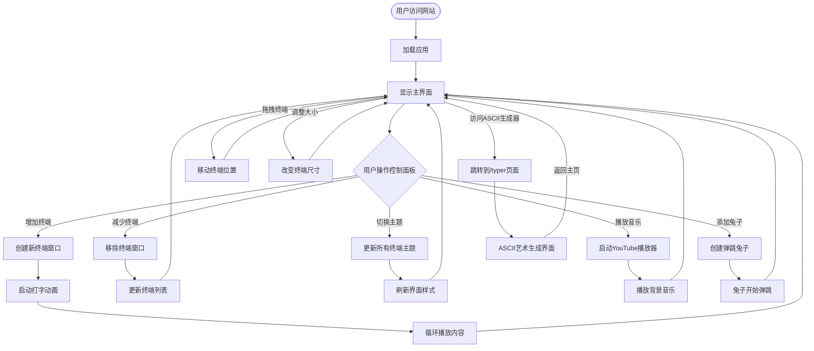

# MultiTerminalCodeViz - 多终端代码可视化工具

[](https://www.IVibeMoreThanYou.com/)
[](https://reactjs.org/)
[](https://www.typescriptlang.org/)
[](https://vitejs.dev/)
[](https://tailwindcss.com/)

## 📋 项目来源

本项目 Fork 自 [https://github.com/gkamradt/MultiTerminalCodeViz](https://github.com/gkamradt/MultiTerminalCodeViz)

**本地化改进说明：**
- ✅ **中文化翻译** - README 文档已从英文完整翻译为中文版本
- ✅ **文档完善** - 对原项目文档进行了大幅补充和完善，增加了更详细的使用说明
- ✅ **架构图表** - 新增了项目架构图、数据流图和用户交互流程图
- ✅ **开发指南** - 添加了完整的开发指南、API 文档和贡献指南
- ✅ **技术说明** - 详细解释了真实 vs 模拟的技术实现原理

> 🎉 **这是一个有趣的项目 - 欢迎提交 PR！**

一个基于 React 的多终端代码可视化工具，可以显示多个可拖拽、可调整大小的终端窗口，具有动画打字效果。每个终端显示不同的开发场景，支持自定义主题和可变打字速度。

## ✨ 主要特性

- 🖥️ **多终端窗口** - 支持同时显示多个终端窗口（1-10000个）
- 🎨 **多种主题** - 内置多种终端主题（Dark、Light、Matrix、Dracula、Solarized等）
- 🎭 **动画效果** - 逼真的打字动画效果，模拟真实的编程场景
- 🎯 **拖拽调整** - 终端窗口可自由拖拽和调整大小
- 🎵 **背景音乐** - 集成 YouTube 音频播放器，支持 lofi 背景音乐
- 🐰 **彩蛋功能** - 可爱的弹跳兔子动画
- 📱 **响应式设计** - 支持不同屏幕尺寸
- 🎪 **ASCII 艺术** - 内置 ASCII 艺术生成器

## 🔍 技术实现说明

### 真实 vs 模拟

很多人会好奇：**这个项目是真的可以让1000多个终端同时运行吗？还是模拟做的界面？**

**答案是：这是真实的多终端窗口系统，但内容是模拟的开发场景，并且使用了聪明的性能优化。**

#### ✅ **真实的部分：**
- **终端窗口组件** - 每个都是真实的React组件，有独立的状态和生命周期
- **拖拽和调整大小** - 真实的用户交互，使用 `react-draggable` 和 `react-resizable`
- **独立的动画状态** - 每个终端有自己的打字动画和循环逻辑
- **主题切换** - 真实的样式变化，影响所有终端
- **数量计数** - 真实可以创建到10,000个终端实例

#### 🎭 **模拟的部分：**
- **终端内容** - 不是真实的命令行执行，而是预设的开发场景文本
- **打字效果** - 模拟的逐字符显示动画，不是真实的命令输出
- **开发场景** - 包含构建、测试、调试等预设的开发者日常工作内容

#### ⚡ **性能优化策略：**
```typescript
// 智能渲染优化
const maxRenderedTerminals = actualTerminalCount > 1000 ? 40 : 80;
```

**这意味着：**
- **逻辑上**：可以有10,000个终端（状态中记录和管理）
- **视觉上**：只渲染最新的40-80个终端（DOM中实际存在）
- **用户体验**：感觉像是有很多终端在同时运行

#### 💡 **实际使用建议：**
- **日常演示**: 50个以下终端效果最佳，流畅且美观
- **性能测试**: 可以测试到1000+个，会有一定性能影响
- **极限测试**: 理论上可以到10,000个，但主要是数字展示

这种设计让项目既能提供真实的多终端体验，又能保持良好的性能表现。

## 🚀 快速开始

```bash
# 克隆项目
git clone https://github.com/nicekate/MultiTerminalCodeViz
cd MultiTerminalCodeViz

# 安装依赖
npm install

# 启动开发服务器
npm run dev

# 在浏览器中打开 http://localhost:5173
```

## 📋 目录

- [技术栈](#-技术栈)
- [项目架构](#-项目架构)
- [目录结构](#-目录结构)
- [安装和配置](#-安装和配置)
- [主要功能模块](#-主要功能模块)
- [开发指南](#-开发指南)
- [API 文档](#-api-文档)
- [贡献指南](#-贡献指南)
- [常见问题](#-常见问题)

## 🛠️ 技术栈

### 核心技术
- **React 18.2.0** - 用户界面库
- **TypeScript 5.2.2** - 类型安全的 JavaScript
- **Vite 5.2.0** - 现代化构建工具
- **Tailwind CSS 3.4.3** - 实用优先的 CSS 框架

### 主要依赖
- **react-draggable** - 拖拽功能实现
- **react-resizable** - 窗口大小调整
- **react-router-dom** - 路由管理
- **html2canvas** - 截图功能
- **@vercel/analytics** - 网站分析

### 开发工具
- **ESLint** - 代码质量检查
- **Prettier** - 代码格式化
- **Vitest** - 单元测试框架
- **@testing-library/react** - React 组件测试

## 🏗️ 项目架构

### 整体架构图



### 数据流图



### 用户交互流程图



## 📁 目录结构

```
MultiTerminalCodeViz/
├── public/                          # 静态资源
│   ├── favicon.ico                  # 网站图标
│   ├── bunny.gif                    # 彩蛋兔子动画
│   ├── sonomaBackground.jpg         # 背景图片
│   └── og.png                       # Open Graph 图片
├── src/                             # 源代码
│   ├── components/                  # React 组件
│   │   ├── BouncyBunny/            # 弹跳兔子组件
│   │   │   └── BouncyBunny.tsx
│   │   ├── ControlsPanel/          # 控制面板组件
│   │   │   └── ControlsPanel.tsx
│   │   ├── TerminalWindow/         # 终端窗口组件
│   │   │   ├── TerminalWindow.tsx
│   │   │   └── TerminalWindow.css
│   │   └── YouTubeAudioPlayer/     # YouTube 音频播放器
│   │       ├── YouTubeAudioPlayer.tsx
│   │       └── SimpleYouTubePlayer.tsx
│   ├── contexts/                    # React 上下文
│   │   ├── AppContext.tsx          # 应用全局状态
│   │   ├── ThemeContext.tsx        # 主题管理
│   │   └── __tests__/              # 上下文测试
│   ├── data/                        # 数据文件
│   │   ├── colorThemes.ts          # 终端主题配置
│   │   └── terminalOutputs.ts      # 终端输出内容
│   ├── hooks/                       # 自定义 Hook
│   │   └── useTypewriter.ts        # 打字动画 Hook
│   ├── pages/                       # 页面组件
│   │   └── AsciiTyper.tsx          # ASCII 艺术生成器页面
│   ├── utils/                       # 工具函数
│   │   └── asciiArt.ts             # ASCII 艺术生成工具
│   ├── App.tsx                      # 主应用组件
│   ├── App.css                      # 应用样式
│   ├── main.tsx                     # 应用入口
│   └── index.css                    # 全局样式
├── planning/                        # 项目规划文档
│   ├── plan.md                     # 开发计划
│   ├── spec.md                     # 项目规格说明
│   └── todo.md                     # 待办事项
├── package.json                     # 项目配置
├── vite.config.ts                  # Vite 配置
├── tailwind.config.js              # Tailwind CSS 配置
├── tsconfig.json                   # TypeScript 配置
└── vercel.json                     # Vercel 部署配置
```

## ⚙️ 安装和配置

### 环境要求

- **Node.js** >= 16.0.0
- **npm** >= 8.0.0 或 **yarn** >= 1.22.0

### 详细安装步骤

1. **克隆仓库**
   ```bash
   git clone https://github.com/nicekate/MultiTerminalCodeViz.git
   cd MultiTerminalCodeViz
   ```

2. **安装依赖**
   ```bash
   npm install
   # 或使用 yarn
   yarn install
   ```

3. **启动开发服务器**
   ```bash
   npm run dev
   # 或使用 yarn
   yarn dev
   ```

4. **构建生产版本**
   ```bash
   npm run build
   # 或使用 yarn
   yarn build
   ```

5. **预览生产版本**
   ```bash
   npm run preview
   # 或使用 yarn
   yarn preview
   ```

### 开发环境配置

#### VS Code 推荐扩展
- **ES7+ React/Redux/React-Native snippets** - React 代码片段
- **TypeScript Importer** - 自动导入 TypeScript 类型
- **Tailwind CSS IntelliSense** - Tailwind CSS 智能提示
- **ESLint** - 代码质量检查
- **Prettier** - 代码格式化

#### 环境变量配置
项目目前不需要特殊的环境变量配置，所有功能都是客户端实现。

## 🧩 主要功能模块

### 1. 终端窗口组件 (TerminalWindow)

**位置**: `src/components/TerminalWindow/TerminalWindow.tsx`

**功能特性**:
- ✅ Mac 风格的终端界面设计
- ✅ 可拖拽和调整大小
- ✅ 多种主题支持
- ✅ 逼真的打字动画效果
- ✅ 自动循环播放内容

**核心代码示例**:
```typescript
interface TerminalWindowProps {
  id: string;
  initialPosition?: { x: number; y: number };
  title?: string;
  onClose?: () => void;
  zIndex?: number;
  totalTerminalCount?: number;
}
```

### 2. 控制面板组件 (ControlsPanel)

**位置**: `src/components/ControlsPanel/ControlsPanel.tsx`

**功能特性**:
- ✅ 终端数量控制（1-10000个）
- ✅ 主题切换
- ✅ 音频播放器集成
- ✅ 兔子动画控制
- ✅ 面板显示/隐藏切换

**使用方法**:
```typescript
<ControlsPanel
  terminalCount={terminalCount}
  onTerminalCountChange={handleTerminalCountChange}
  onArrangeTerminals={handleArrangeTerminals}
  bunnyCount={bunnies.length}
  onRemoveAllBunnies={handleRemoveAllBunnies}
/>
```

### 3. 打字动画 Hook (useTypewriter)

**位置**: `src/hooks/useTypewriter.ts`

**功能特性**:
- ✅ 基于令牌的打字效果（3-6字符块）
- ✅ 可配置的打字速度
- ✅ 循环播放支持
- ✅ 延迟控制

**使用示例**:
```typescript
const { displayedLines, isTyping } = useTypewriter({
  lines: terminalOutputs.conversation,
  speed: 50, // 毫秒每令牌
  enabled: true,
  loop: true,
  loopDelay: 3000
});
```

### 4. 主题系统

**位置**: `src/contexts/ThemeContext.tsx` 和 `src/data/colorThemes.ts`

**支持的主题**:
- 🌙 **Dark** - 经典深色主题
- ☀️ **Light** - 明亮浅色主题
- 🟢 **Matrix** - 黑客帝国风格
- 🧛 **Dracula** - Dracula 配色方案
- 🌅 **Solarized** - Solarized Dark 主题

**主题配置结构**:
```typescript
interface TerminalTheme {
  name: string;
  background: string;
  colors: Record<TerminalColorRole, string>;
}
```

### 5. ASCII 艺术生成器

**位置**: `src/pages/AsciiTyper.tsx` 和 `src/utils/asciiArt.ts`

**功能特性**:
- ✅ 实时 ASCII 艺术生成
- ✅ 多行文本支持
- ✅ 自定义颜色配置
- ✅ 文本和图片导出功能

**访问方式**: 访问 `/typer` 路径

### 6. 弹跳兔子动画

**位置**: `src/components/BouncyBunny/BouncyBunny.tsx`

**功能特性**:
- ✅ 物理引擎模拟的弹跳效果
- ✅ 边界碰撞检测
- ✅ 性能优化（基于兔子数量的帧率调节）
- ✅ 响应式窗口大小调整

## 🔧 开发指南

### 可用脚本命令

```bash
# 开发相关
npm run dev          # 启动开发服务器
npm run build        # 构建生产版本
npm run preview      # 预览生产版本

# 代码质量
npm run lint         # 运行 ESLint 检查
npm run format       # 使用 Prettier 格式化代码

# 测试相关
npm run test         # 运行单元测试
npm run test:ui      # 运行测试 UI 界面

# 部署相关
npm run vercel-build # Vercel 部署构建
```

### 测试策略

项目使用 **Vitest** 作为测试框架，配合 **@testing-library/react** 进行组件测试。

**运行测试**:
```bash
# 运行所有测试
npm run test

# 运行测试并显示覆盖率
npm run test -- --coverage

# 运行测试 UI 界面
npm run test:ui
```

**测试文件位置**:
- 组件测试: `src/components/**/__tests__/`
- 上下文测试: `src/contexts/__tests__/`
- Hook 测试: `src/hooks/__tests__/`

### 代码规范

项目使用 **ESLint** 和 **Prettier** 确保代码质量和一致性。

**ESLint 配置**:
- 基于 Airbnb 配置
- TypeScript 支持
- React Hooks 规则
- 可访问性检查

**代码格式化**:
```bash
# 格式化所有文件
npm run format

# 检查代码规范
npm run lint
```

### 性能优化建议

1. **终端数量控制**: 建议同时显示的终端数量不超过 100 个
2. **动画性能**: 大量终端时会自动降低帧率
3. **内存管理**: 组件卸载时会自动清理定时器和动画
4. **懒加载**: 考虑对大量组件实施虚拟化

### 添加新功能

#### 1. 添加新的终端输出类型

在 `src/data/terminalOutputs.ts` 中添加新的输出数据：

```typescript
export const newOutputType: TerminalLine[] = [
  { text: "Your new content here", colorRole: "primary" },
  // ... 更多行
];

// 在 terminalOutputs 对象中注册
export const terminalOutputs = {
  // ... 现有类型
  newType: newOutputType
};
```

#### 2. 添加新主题

在 `src/data/colorThemes.ts` 中添加新主题：

```typescript
export const terminalThemes: Record<string, TerminalTheme> = {
  // ... 现有主题
  newTheme: {
    name: 'New Theme',
    background: 'bg-custom-color',
    colors: {
      primary: 'text-custom-primary',
      // ... 其他颜色角色
    }
  }
};
```

#### 3. 添加新组件

1. 在 `src/components/` 下创建新文件夹
2. 创建组件文件和样式文件
3. 添加对应的测试文件
4. 在需要的地方导入和使用

## 📚 API 文档

### 核心 Hook API

#### useTypewriter

```typescript
interface UseTypewriterProps {
  lines: TerminalLine[];        // 要显示的文本行
  speed?: number;               // 打字速度（毫秒/令牌）
  enabled?: boolean;            // 是否启用动画
  loop?: boolean;               // 是否循环播放
  loopDelay?: number;           // 循环间隔时间
}

interface UseTypewriterReturn {
  displayedLines: TerminalLine[]; // 当前显示的行
  isTyping: boolean;              // 是否正在打字
  reset: () => void;              // 重置动画
}
```

#### useTheme

```typescript
interface ThemeContextType {
  currentTheme: TerminalTheme;           // 当前主题
  themeName: string;                     // 主题名称
  setTheme: (themeName: string) => void; // 设置主题
  getThemeNames: () => string[];         // 获取所有主题名称
  getColorForRole: (role: TerminalColorRole) => string; // 获取角色颜色
}
```

### 组件 Props API

#### TerminalWindow Props

```typescript
interface TerminalWindowProps {
  id: string;                                    // 终端唯一标识
  initialPosition?: { x: number; y: number };   // 初始位置
  initialSize?: { width?: number; height?: number }; // 初始大小
  title?: string;                                // 窗口标题
  onClose?: () => void;                         // 关闭回调
  onPositionChange?: (id: string, position: { x: number; y: number }) => void; // 位置变化回调
  zIndex?: number;                              // 层级
  onFocus?: (id: string) => void;               // 聚焦回调
  totalTerminalCount?: number;                  // 总终端数量
}
```

#### ControlsPanel Props

```typescript
interface ControlsPanelProps {
  terminalCount: number;                        // 当前终端数量
  onTerminalCountChange: (count: number) => void; // 终端数量变化回调
  onArrangeTerminals?: () => void;              // 重新排列终端回调
  minTerminals?: number;                        // 最小终端数量
  maxTerminals?: number;                        // 最大终端数量
  bunnyCount?: number;                          // 兔子数量
  onRemoveAllBunnies?: () => void;              // 移除所有兔子回调
}
```

## 🤝 贡献指南

我们欢迎所有形式的贡献！无论是 bug 报告、功能请求还是代码贡献。

### 贡献流程

1. **Fork 项目**
   ```bash
   # 点击 GitHub 页面上的 Fork 按钮
   ```

2. **克隆你的 Fork**
   ```bash
   git clone https://github.com/your-username/MultiTerminalCodeViz.git
   cd MultiTerminalCodeViz
   ```

3. **创建功能分支**
   ```bash
   git checkout -b feature/your-feature-name
   # 或
   git checkout -b fix/your-bug-fix
   ```

4. **进行开发**
   - 遵循现有的代码风格
   - 添加必要的测试
   - 确保所有测试通过

5. **提交更改**
   ```bash
   git add .
   git commit -m "feat: add your feature description"
   # 或
   git commit -m "fix: fix your bug description"
   ```

6. **推送到你的 Fork**
   ```bash
   git push origin feature/your-feature-name
   ```

7. **创建 Pull Request**
   - 在 GitHub 上创建 PR
   - 详细描述你的更改
   - 等待代码审查

### 提交信息规范

使用 [Conventional Commits](https://www.conventionalcommits.org/) 规范：

- `feat:` 新功能
- `fix:` Bug 修复
- `docs:` 文档更新
- `style:` 代码格式化
- `refactor:` 代码重构
- `test:` 测试相关
- `chore:` 构建过程或辅助工具的变动

### 代码审查标准

- ✅ 代码符合 ESLint 规则
- ✅ 所有测试通过
- ✅ 新功能有对应的测试
- ✅ 代码有适当的注释
- ✅ 性能影响在可接受范围内

## ❓ 常见问题

### Q: 为什么终端数量很多时会变卡？

**A**: 这是正常现象。当终端数量超过 100 个时，系统会自动降低动画帧率来保持性能。建议：
- 日常使用保持在 50 个以下
- 演示时可以短暂使用更多终端
- 关闭不必要的浏览器标签页

### Q: 如何添加自定义的终端输出内容？

**A**: 有两种方式：
1. **修改现有数据**: 编辑 `src/data/terminalOutputs.ts` 文件
2. **添加新类型**: 在同一文件中添加新的输出类型并注册

```typescript
// 示例：添加自定义内容
export const customOutput: TerminalLine[] = [
  { text: "你的自定义内容", colorRole: "primary" }
];
```

### Q: 如何自定义主题颜色？

**A**: 编辑 `src/data/colorThemes.ts` 文件：

```typescript
// 添加新主题
myCustomTheme: {
  name: 'My Theme',
  background: 'bg-gray-900',
  colors: {
    primary: 'text-green-400',
    // ... 其他颜色
  }
}
```

### Q: 音频播放器不工作怎么办？

**A**: 可能的原因和解决方案：
- **浏览器自动播放策略**: 现代浏览器需要用户交互才能播放音频
- **网络问题**: 检查网络连接
- **YouTube 限制**: 某些视频可能有嵌入限制

### Q: 如何在移动设备上使用？

**A**: 项目主要为桌面设计，但在移动设备上也可以基本使用：
- 终端窗口会自动缩放
- 拖拽功能在触屏上可能不够流畅
- 建议使用横屏模式获得更好体验

### Q: 如何部署到自己的服务器？

**A**: 项目是纯静态网站，可以部署到任何静态托管服务：

```bash
# 构建项目
npm run build

# dist 文件夹包含所有静态文件
# 上传到你的服务器或 CDN
```

支持的平台：
- **Vercel** (推荐)
- **Netlify**
- **GitHub Pages**
- **AWS S3**
- 任何支持静态文件的服务器

### Q: 如何报告 Bug 或请求新功能？

**A**: 请在 GitHub 上创建 Issue：
1. 访问 [Issues 页面](https://github.com/nicekate/MultiTerminalCodeViz/issues)
2. 点击 "New Issue"
3. 选择合适的模板
4. 详细描述问题或需求

---

## 📄 许可证

本项目采用 MIT 许可证。详见 [LICENSE](LICENSE) 文件。

## 🙏 致谢

- 感谢所有贡献者的努力
- 特别感谢开源社区提供的优秀工具和库
- 灵感来源于经典的终端模拟器和开发者工具

---

**🎉 享受编码的乐趣！如果这个项目对你有帮助，请给我们一个 ⭐️**
```